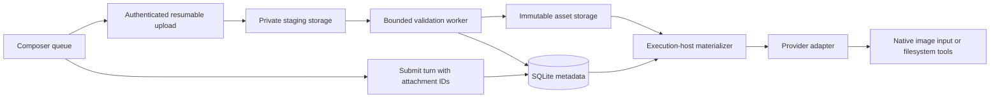

# Reliable file attachments

Research and proposed architecture · 6 September 2026

Status: design recommendation, not an implemented upload feature. This review covers the existing Webcode implementation, official documentation, and T3 Code source. It does not establish production performance or mobile compatibility through execution tests.

## Decision

Build a provider-independent attachment service with resumable binary uploads, durable private storage, transactional turn references, and an adapter that prepares attachments for each provider. Start with the existing Node server, SQLite, and a persistent VPS volume. Keep storage and execution-host materialization behind interfaces so object storage and additional providers can be introduced later.

The key invariant: **a turn can reference only verified, authorized, durable attachments, and retries must preserve exactly the same attachment set.**

## What exists in Webcode

The paperclip is disabled. There are no upload routes, attachment records, or attachment inputs in the runtime contract. A reusable attachment UI primitive alone does not supply those services.

The relevant integration points are:

| Existing file | Required change |
| --- | --- |
| `app/page.tsx` | Composer queue, picker, progress, retry, cancellation, attachment-only submission |
| `lib/api/client.ts` | Upload control/status and authorized downloads |
| `lib/workspace/contracts.ts` | Public attachment metadata and ordered turn references |
| `lib/providers/contracts.ts` | Explicit model/adapter attachment capabilities |
| `server/http/workspace-routes.ts` | Validate attachment IDs alongside the prompt |
| `server/core/agent-service.ts` | Include attachments in idempotency and transactional submission |
| `server/storage/sqlite-workspace-store.ts` | Upload, asset, reference, and processing-lease persistence |
| `server/runtime/agent-runtime.ts` | Prepared, provider-neutral attachment input |
| `server/providers/codex/discovery.ts` | Preserve model input modalities |
| `server/providers/codex/protocol.ts` | Typed native image input |
| `server/providers/codex/turn-runtime.ts` | Materialized file delivery and resume lifetime |
| `server/app.ts`, `server/config.ts` | Stream routes, quotas, storage configuration, lifecycle cleanup |

Keep uploads outside the existing 256 KiB JSON request limit, 64 KiB WebSocket limit, and bounded Codex JSON channel. Raising all those limits would spread memory and reliability problems through unrelated operations. The current sessionStorage send record can retain attachment IDs; it should not contain file bytes.

## Official Codex behavior

Codex App Server documents text, remote-image, and local-image turn inputs. Its model listing exposes input modalities; sandbox configuration also determines filesystem readability. The installed CLI's generated `UserInput` schema, checked at version 0.152.0, has `localImage` but no generic `input_file` variant. This is the relevant protocol for our adapter. [App Server documentation](https://developers.openai.com/codex/app-server)

The Responses API separately supports `input_file`, including uploaded file IDs, and has document-processing behavior for PDFs and other formats. That is a different integration. We should not add a Files API dependency or assume its document-processing behavior applies to the current Codex provider. [OpenAI file inputs](https://developers.openai.com/api/docs/guides/file-inputs)

Our proposed delivery policy:

| Attachment | Codex delivery | User-visible promise |
| --- | --- | --- |
| Verified supported image | `localImage` referencing a stable server-created path, when the selected model supports images | Image supplied natively |
| Text, Markdown, source, JSON, CSV | File path manifest for filesystem tools | File available to the agent |
| PDF, Office documents, archives | File path; optional explicitly supported processing pipeline | Stored and available; interpretation depends on installed tools |
| HEIC or another unsupported image format | Validated conversion derivative, or actionable rejection | Never silently accepted as a native image |

Do not infer support from the model name. Effective capability is the intersection of the model, adapter, available processing tools, and configured product limits. Audio appearing in a generated protocol is not sufficient to promise end-to-end audio support.

## What T3 Code actually implements

Reviewed public source at commit **`eb8ed80300bd719b49fc80ad8708f9839bb48c92`**, dated 6 September 2026. Source inspection only; T3 was not installed or executed. Current source includes generic files, so older issues requesting file support are not a reliable description of today's implementation.

| Finding | Evidence | Decision for Webcode |
| --- | --- | --- |
| Separate signed upload route; raw streamed bytes; temporary file followed by rename; declared-size enforcement | [AttachmentUpload.ts](https://github.com/pingdotgg/t3code/blob/eb8ed80300bd719b49fc80ad8708f9839bb48c92/apps/server/src/assets/AttachmentUpload.ts) | Adopt separate upload and message operations, staging and bounded streaming |
| Browser queue tracks progress, failures, aborts and execution environment; three concurrent uploads per environment | [attachmentUploadQueue.ts](https://github.com/pingdotgg/t3code/blob/eb8ed80300bd719b49fc80ad8708f9839bb48c92/apps/web/src/lib/attachmentUploadQueue.ts) | Adopt explicit states and environment ownership; add byte-offset resume |
| Pending upload is copied into a thread-scoped file, preserving the retry source and avoiding shared writable content | [Normalizer.ts](https://github.com/pingdotgg/t3code/blob/eb8ed80300bd719b49fc80ad8708f9839bb48c92/apps/server/src/orchestration/Normalizer.ts) | Preserve immutable source assets and isolate execution copies |
| IDs and path resolution are controlled; pending and partial uploads expire | [attachmentStore.ts](https://github.com/pingdotgg/t3code/blob/eb8ed80300bd719b49fc80ad8708f9839bb48c92/apps/server/src/attachmentStore.ts) | Use opaque IDs, explicit references, leases and scheduled reconciliation |
| Contract permits eight attachments; image limit 10 MiB and generic-file limit 50 MiB | [orchestration.ts](https://github.com/pingdotgg/t3code/blob/eb8ed80300bd719b49fc80ad8708f9839bb48c92/packages/contracts/src/orchestration.ts) | Treat these as useful product defaults, not OpenAI limits |
| Shared provider service adds on-disk attachment paths to the prompt | [ProviderService.ts](https://github.com/pingdotgg/t3code/blob/eb8ed80300bd719b49fc80ad8708f9839bb48c92/apps/server/src/provider/Layers/ProviderService.ts) | Keep filesystem delivery provider-neutral; encode names as data |
| Codex adapter reads images and constructs base64 data URLs | [CodexAdapter.ts](https://github.com/pingdotgg/t3code/blob/eb8ed80300bd719b49fc80ad8708f9839bb48c92/apps/server/src/provider/Layers/CodexAdapter.ts) | Prefer local-image paths here to avoid base64 expansion and our JSON ceiling |

In the inspected browser/route path, retry reissues an upload rather than negotiating a persisted byte offset. That is a specific difference from the resumable transport proposed below, not a claim that T3's entire upload system is unreliable.

## Transport and mobile recovery

Use **tus**, with `tus-js-client` and `@tus/server` plus a disk store initially. The protocol uses HEAD to recover the current offset and PATCH to continue; conflicting offsets are rejected. Authentication remains our responsibility. [tus protocol](https://tus.io/protocols/resumable-upload)

The official Node implementation supports disk and object-storage backends and documents Fastify integration. Its current extension table does **not** support the checksum extension. Compute and persist an application-level SHA-256 during finalization instead; do not claim protocol checksum support. Verify the chosen version and hooks in an integration spike before committing to the dependency. [tus Node server](https://github.com/tus/tus-node-server)

The browser client supports discovering and resuming previous uploads. Its examples still supply a File: recovering an upload URL does not recover missing local bytes. [tus browser client](https://github.com/tus/tus-js-client/blob/main/docs/usage.md)

Our implementation should:

- Persist upload IDs, draft association, environment identity, status and expiration. Keep bearer credentials out of persisted queue data.
- Offer optional IndexedDB file caching within a bounded device quota. Treat eviction or denied storage as expected: ask the user to reselect the original file, then verify its identity before resuming. Filename and size alone are insufficient to prevent mixing different files.
- Show paused/offline status when a phone suspends the page. Resume on return; do not promise uploads continue after the browser closes.
- Require an explicit new transfer when the local bytes are unavailable on another device. Completed server assets should be available from every authorized device.
- Integrate the streaming route before body buffering. Add required HEAD/PATCH/DELETE and tus headers to scoped CORS configuration; the current API allows GET/POST/OPTIONS only. Keep other JSON limits intact.
- Authenticate and authorize every upload method, status query, cancellation and read. Check effective methods if supporting method override. Verify proxy headers, streaming behavior, request limits and timeouts through the actual VPS proxy.

A regular streamed POST would be simpler, but each failure could retransmit the entire file. Given mobile access is a core requirement, offset resume is worth implementing at the transport boundary now.

## Persistence and transaction boundaries

Introduce these concepts rather than a single attachment boolean:

| Record | Purpose |
| --- | --- |
| `upload_sessions` | Authorized scope, draft, expected bytes, upload resource, expiry, status and reserved quota |
| `assets` | Opaque ID, private storage key, display name, observed MIME/size, SHA-256, validation version, ready/deleting/failed state |
| `turn_attachments` | Ordered asset references, unique per turn/position, with foreign keys |
| `draft_attachments` | Durable draft references independent of a running turn |
| `asset_leases` / processing jobs | Prevent cleanup during validation, materialization and execution; recover abandoned work |

Upload-session states: `created → uploading → verifying → complete`, with explicit failed, cancelled and expired outcomes. An asset becomes `ready` only after validation and durable publication. “Attached” is a relationship, not a terminal asset state, because an asset may be reused.

Finalization must be idempotent. Stream into private staging, verify observed size and content, hash, flush, and atomically rename on the same filesystem; then commit ready metadata. Filesystem publication and SQLite are not one atomic transaction. A durable processing record and restart reconciler must repair the gap: discover published objects, verify them, finish metadata, or mark failure without exposing partial files.

Submission runs one database transaction that validates ready assets and their scope, adds ordered references, creates the turn, and writes its initial event. Include the ordered asset IDs in the existing request fingerprint. A duplicate request returns the original turn; the same request ID with different files is a conflict. Missing or unfinished attachments must never become a silent text-only submission.

Acquire references/leases before materializing or dispatching. Garbage collection must atomically claim only unreferenced, unleased assets, and new bindings must reject assets claimed for deletion. Archive is not deletion. Retain attached originals for the task lifetime; task deletion explicitly releases references. Proposed staging expiry: 24 hours, configurable and visible. Sweep on a schedule and startup, not only when another upload occurs.

Back up metadata and blobs together with a documented restore procedure. Restoring only SQLite can leave a convincing transcript whose attachments no longer exist.

## Storage, validation and isolation

Use a configured persistent private volume outside project checkouts and the public web directory. Storage keys are server-generated; display names never become directory paths. Separate originals, staging and derived previews. Avoid hard links from immutable originals into agent-writable directories.

File-upload guidance recommends layered validation, generated storage names, authorization and storage outside the webroot. Neither browser MIME nor an extension proves file contents. [OWASP File Upload guidance](https://cheatsheetseries.owasp.org/cheatsheets/File_Upload_Cheat_Sheet.html)

Our concrete policy should check observed bytes, signatures where applicable, safe metadata lengths and image dimensions/pixel count. Source files are legitimate uploads in a coding workspace; store them inertly. Never automatically execute uploaded scripts or extract archives. Put image conversion, thumbnailing and later document parsing in bounded workers with memory, time, output-size and decompression limits.

Start with configurable product limits: eight attachments, 10 MiB per image, 50 MiB per general file, 100 MiB total per turn, two active transfers per browser and four globally. These are proposed defaults, subject to measured VPS capacity. Reserve disk quota at creation, enforce actual consumption while streaming, and maintain a minimum-free-space threshold. Fail cleanly on a full disk.

Download originals through authorized endpoints with safe Content-Disposition and `nosniff`; do not render arbitrary HTML/SVG as same-origin active content. Serve bounded derived image previews. With today's bearer authentication, fetch previews with authorization and create/revoke browser object URLs: an ordinary image URL cannot carry our custom Authorization header. Do not put the persistent bearer token into URLs.

The current shared bearer token represents one trusted workspace, not independent users. Bind records to that workspace/project now. Multi-user ownership and tenant isolation require real identities and authorization, beyond adding an `ownerId` column.

## Provider boundary and task resumption

Create an `AssetStore` interface for durable storage and an `AttachmentMaterializer` for a specific execution environment. Browser contracts contain asset IDs and metadata, never trusted filesystem paths or provider upload IDs.

The materializer verifies content and produces stable task-scoped paths readable by the runtime. Keep those paths stable across Codex process and application restarts; native conversation history may refer to earlier attachments. Rehydrate historical attachments before resuming on a replacement worker. Test the actual sandbox configuration instead of widening write access to the original storage directory.

Application conventions and chmod alone do not isolate originals from a process running as the same OS user. Strong isolation requires appropriate process identities or read-only mounts. This distinction should remain explicit in deployment documentation.

Each adapter selects native input, filesystem reference, or a supported conversion. A future provider-specific remote file ID belongs in an adapter cache keyed by asset hash, account and provider, with expiry handling. It must not become the canonical attachment identity.

File names and manifests must be encoded as data, and attachment contents distinguished from the user's instructions. Do not concatenate unescaped names into shell commands or instruction-like prompt fragments. A manifest makes files discoverable; it does not guarantee the model understood a PDF or eliminate prompt injection.

## Composer and transcript behavior

Preserve the existing chat style. Add an accessible paperclip picker for files/photos, desktop drag/drop and paste, and compact attachment cards with filename, size, preview where supported and a clear state: uploading, verifying, ready, paused or failed. Include retry, cancel and remove with touch-sized controls and keyboard labels.

Enable Send only when every selected attachment is ready and compatible with the selected provider/model. Recheck on the server. Permit attachment-only messages through an explicit adapter policy; do not require users to type a dummy character. Reset the file input so the same file can be selected again. Removing a draft card must not delete an original already referenced by a sent turn.

Sent messages retain ordered attachment cards after refresh and on other devices. Missing/deleted content must render an explicit unavailable state. Large names wrap; card rows do not widen the conversation; thumbnails must not decode full-resolution originals. Surface HEIC handling clearly for phone photos.

## Scaling without a premature rewrite

The first deployment remains one service with bounded streaming and a small durable processing queue. Store bytes on disk, metadata in SQLite, and expose metrics for upload failures, bytes, finalization latency, disk space, queue depth, resume outcomes and cleanup failures. Avoid logging contents or credentials.

Later, swap the storage implementation for object storage and materialize files into worker-local caches. Object storage alone does not make the current AgentService or SQLite deployment horizontally scalable. Multiple active execution servers additionally require shared metadata, distributed job/asset leases, routing and coordinated quotas. Introduce those when that deployment is needed.

## Delivery sequence and release gates

1. **Transport spike:** prove tus authentication, raw Fastify routing, interrupted-upload resume, cancellation, disk-full behavior and proxy compatibility. Pin versions after verification.
2. **Durable foundation:** migrations, storage, finalization recovery, quota reservations, references and cleanup races. Preserve old turns with an empty attachment list.
3. **Codex delivery:** image modality discovery, local-image input, filesystem manifests, stable paths and restart/resume checks. Add a fake second adapter contract test to ensure storage stays provider-neutral.
4. **Composer and history:** picker, drop/paste, queue, authorized previews, attachment-only messages, reload recovery and cross-device completed-file access.
5. **Release validation:** run through the VPS proxy on desktop, iOS Safari and Android Chrome, including slow connections and background/foreground transitions.

Required tests cover truncated/oversized uploads, wrong offsets, repeated finalize, simultaneous PATCH requests, authentication expiry, server restart during publication, missing/tampered assets, cleanup versus send, duplicate sends with changed attachments, Unicode/path traversal names, misleading MIME, huge image dimensions, HTML previews, same-name different files, and tool access after task resume. Use bounded-memory load tests to verify concurrency limits, rather than treating a successful small upload as proof of scalability.

Completion means an interruption cannot silently lose a selected file, a retry cannot create a different turn, an agent cannot receive another scope's asset, and a retained task can still resolve its attachments after restart. Mobile support must be demonstrated on devices before describing it as complete.
